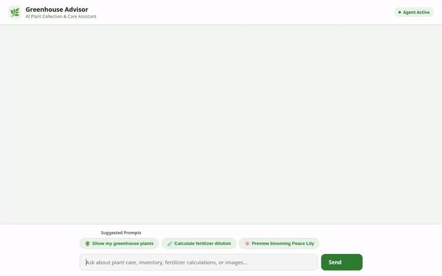

# 🌿 Greenhouse Advisor

An intelligent, multi-turn AI assistant designed to help greenhouse managers and plant enthusiasts track plant inventories, monitor environmental conditions, log watering schedules, lookup botanical taxonomy, calculate chemical/fertilizer dilution ratios, and generate custom plant visuals.



---

## 🌟 Key Features & Google Cloud Services

All features listed below are fully implemented in code in `app/` and configured via `agents-cli-manifest.yaml`:

- **🧠 Cross-Session Memory (Vertex AI Memory Bank)**
  - Remembers user preferences, allergies, and plant care history across conversations.
  - Automatically queries remembered memories via `PreloadMemoryTool` and persists conversation sessions to Vertex AI Memory Bank (`VertexAiMemoryBankService`).

- **🪴 Plant Catalog & Care Logging (Google Cloud Firestore)**
  - Stores and retrieves plant inventory details, light requirements, and pet safety info in Firestore (`plants` collection).
  - Logs watering events and dynamically updates `last_watered` timestamps in Firestore.

- **🎨 Rich Agent UI (A2UI v0.8)**
  - Emits A2UI structured JSON components (Cards, Columns, Rows, Text, Images) via `a2ui_callback`.
  - Seamlessly renders structured plant inventory cards in both local chat UI and ADK Playground.

- **🧮 Secure Sandbox Calculations (Agent Engine Sandbox Code Executor)**
  - Runs python calculation code (such as fertilizer dilution and chemical mixing ratios) inside a secure `AgentEngineSandboxCodeExecutor` container.

- **🖼️ AI Plant Image Generation (Gemini 3.1 Flash Lite Image & Cloud Storage)**
  - Generates high-quality plant imagery using `gemini-3.1-flash-lite-image` in the `global` region.
  - Uploads generated image bytes directly to a public Google Cloud Storage bucket (`greenhouse-advisor-assets-*`) and registers them as ADK session artifacts.

- **🎥 AI Time-Lapse Video Generation (Gemini Omni Flash Preview & Cloud Storage)**
  - Produces short plant growth and sprouting time-lapse videos using `gemini-omni-flash-preview` via the Vertex AI Interactions API in the `global` region.
  - Saves video bytes directly to public Cloud Storage and registers them as ADK session artifacts.

- **🌤️ Environmental & Botanical Integrations**
  - **Live Weather**: Fetches real-time temperature (°F) and relative humidity (%) via Open-Meteo REST API to advise on watering needs.
  - **Botanical Taxonomy**: Queries GBIF Species Taxonomy API for scientific names, families, genera, and kingdoms.
  - **Local Nurseries & Maps**: Geocodes locations and discovers nearby florists and garden centers via Google Maps Places API (New).

---

## 🛠️ Repository Structure

```
.
├── app/
│   ├── agent.py          # ADK Root Agent configuration, Memory Bank & Code Executor bindings
│   ├── tools.py          # Firestore, GCS, Gemini Image/Video, Weather, Maps & Taxonomy tools
│   └── a2ui_utils.py     # A2UI callback transformer for card rendering
├── frontend/
│   ├── main.py           # FastAPI proxy server talking A2A protocol to Agent Engine
│   └── static/
│       └── index.html    # Rebranded chat UI with quick-prompt pills & A2UI renderer
├── agents-cli-manifest.yaml  # agents-cli deployment configuration (ACLI 1.1.0)
├── demo.gif              # Looping demo recording of the chat interface
└── README.md             # Project documentation
```

---

## 🚀 Local Setup & Development

### 1. Prerequisites

- Python 3.11+
- `uv` package manager (`pip install uv`)
- Google Cloud SDK (`gcloud`) authenticated with target GCP project

### 2. Install Dependencies

```bash
uv sync
```

### 3. Environment Configuration

Ensure Google Cloud credentials and optional API keys are set in your shell environment:

```bash
export GOOGLE_CLOUD_PROJECT="<your-gcp-project-id>"
export GOOGLE_MAPS_API_KEY="<your-google-maps-api-key>" # Optional, for maps & nurseries
```

### 4. Run the Agent Playground Locally

To launch the ADK Web dev playground:

```bash
adk web --port 8000
```

### 5. Run the Custom Frontend Proxy Locally

To start the FastAPI proxy server and custom chat UI:

```bash
cd frontend
uv run python main.py
```

The frontend proxy will listen locally on port `8080`.

---

## ☁️ Deployment

Deploy the agent to Vertex AI Agent Runtime using `agents-cli`:

```bash
agents-cli deploy
```

Deploy the custom FastAPI proxy to Cloud Run:

```bash
gcloud run deploy greenhouse-advisor-frontend \
  --source ./frontend \
  --region us-east1 \
  --allow-unauthenticated
```
